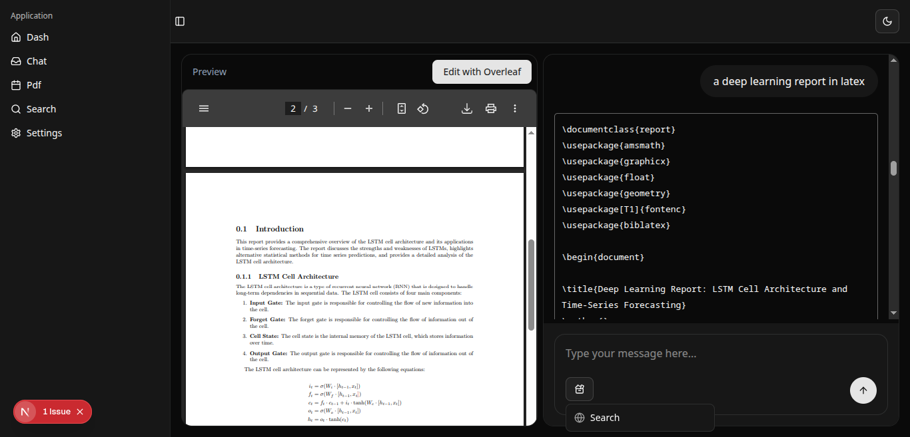

# Sutor - Your AI-Powered LaTeX Generator

Sutor is a full-stack web application that allows you to chat with an AI to generate LaTeX code, visualize the generated LaTeX as a PDF, and seamlessly edit it with Overleaf. It also includes powerful PDF processing capabilities.



## Features

- **AI Chat:** A clean and intuitive chat interface for interacting with a large language model.
- **AI-Powered LaTeX Generation:** Interact with an AI model to generate LaTeX code based on your conversations and requirements.
- **LaTeX Visualization:** Instantly render generated LaTeX code into a viewable PDF within the application.
- **Overleaf Integration:** Seamlessly open and edit your generated LaTeX projects directly in Overleaf for advanced editing and collaboration.
- **PDF Processing:** Upload PDF files to be converted into markdown format, allowing the AI to incorporate their content into conversations.
- **Contextual Conversations:** The content of uploaded PDFs is integrated into the chat, enabling the AI to answer questions and discuss document contents.

## Tech Stack

- **Frontend:**
  - [Next.js](https://nextjs.org/) - A React framework for building user interfaces.
  - [Tailwind CSS](https://tailwindcss.com/) - A utility-first CSS framework for styling.
  - [shadcn/ui](https://ui.shadcn.com/) - A collection of re-usable components.
- **Backend:**
  - [Flask](https://flask.palletsprojects.com/) - A lightweight web framework for Python.
  - [Groq](https://groq.com/) - Powering the AI chat with a large language model.
  - [MarkItDown](https://github.com/dev-med/markitdown) - For converting PDF files to markdown.

## Getting Started

### Prerequisites

- Node.js and npm
- Python and pip
- A Groq API key

### Installation

1. **Clone the repository:**
   ```bash
   git clone https://github.com/Medamine-Bahassou/sutor.git
   cd sutor
   ```

2. **Backend Setup:**
   ```bash
   cd backend
   python -m venv venv
   source venv/bin/activate
   pip install -r requirements.txt
   cp .env.example .env
   # Add your GROQ_API_KEY to the .env file
   flask run
   ```

3. **Frontend Setup:**
   ```bash
   cd frontend
   npm install
   npm run dev
   ```

## Usage

1. Open your browser and navigate to `http://localhost:3000`.
2. Start chatting with the AI.
3. To discuss a PDF, use the attachment feature to upload your file.
4. If the AI generates LaTeX code, it will be rendered as a PDF on the right side of the screen.
